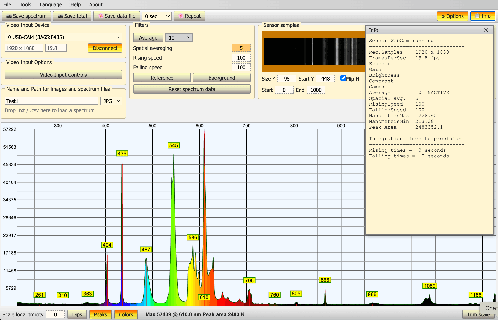
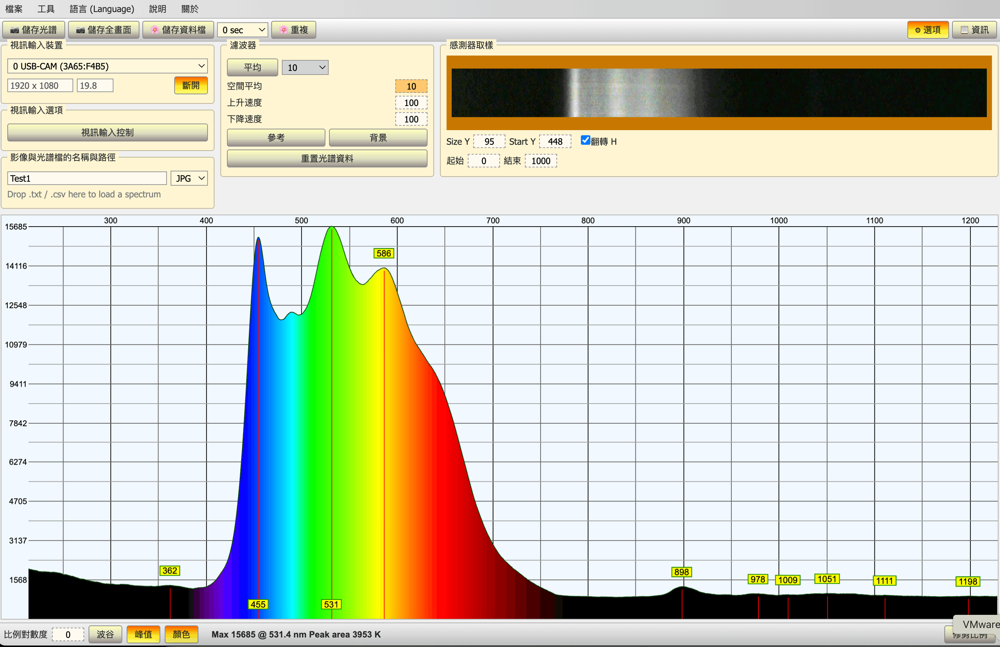

# Web Spectrometer

[English](../README.md) | [简体中文](README.zh-CN.md) | **繁體中文** | [Italiano](README.it.md) | [Français](README.fr.md) | [Português](README.pt.md)

一款 DIY 光譜儀軟體——[Theremino Spectrometer](https://www.theremino.com/en/downloads/automation#spectrometer) V5.0 的 fork 版本,可直接在瀏覽器中運作。

**▶ 線上使用:[spectrometer-web.vercel.app](https://spectrometer-web.vercel.app/)**——無需安裝,用 Chromium 系瀏覽器(Chrome、Edge、Opera 等)開啟即可。

🔒 **隱私**:所有影像處理都在你的瀏覽器本地完成——不會上傳任何資料。



*螢光燈發射光譜:波長軸經 436/546nm 汞線校準後,譜線峰位自動標註;右側為 Info 即時參數視窗*



*白光 LED 連續光譜(中文介面):450nm 藍光激發峰與螢光粉寬譜清晰可辨,頂部為感測器原始影像*

## 初衷

專業光譜分析儀器價格昂貴,許多 DIY 愛好者用 CCD 攝影機加光柵自製光譜儀,配套軟體中公認最好用的是 Theremino Spectrometer——但它只能在 Windows 上運行。本專案將同樣的功能帶進瀏覽器:打開網頁、連上攝影機,即可在 Linux、macOS、Windows 任意平台上使用,讓更多人體驗 DIY 光譜儀的樂趣。

## 用途

把 WebCam(或經串列埠連接的 TCD1304/TCD1254 線性感測器)擷取的光譜影像即時轉換為光譜曲線,可用於:

- 光源分析:螢光燈、LED、雷射等的發射譜線量測
- 光譜校準:多點校準(Trim points),用螢光燈 436/546nm 汞線標定波長軸
- 資料記錄:光譜資料儲存為 CSV/TXT(與 Windows 版 Theremino Spectrometer 檔案互通)、定時/重複自動儲存、圖片匯出

主要功能:即時濾波管線(平均、上升/下降速度、空間平均、參考/背景)、峰谷偵測標註、波長著色、對數座標、輻照係數修正、六種介面語言。可在任何 Chromium 系瀏覽器(Chrome、Edge、Opera 等)中運作;Firefox 與 Safari 因缺少 Web Serial 支援而無法使用。

## 快速開始

```bash
npm install
npm run dev      # 本地開發
npm run build    # 建置產物在 dist/
```

線上部署:匯入 Vercel 即可零設定上線(攝影機需要 HTTPS,Vercel 預設提供)。

首次使用:連接攝影機後按提示用螢光燈完成校準(工具 → 校準點 → 螢光 436 546,然後拖曳頂部 436/546 標籤對準汞譜線)。

## 網域說明

本站刻意使用 Vercel 的免費網域 [spectrometer-web.vercel.app](https://spectrometer-web.vercel.app/),而不是購買獨立網域:我擔心幾年後自己買的網域因為忘記續費而失效,導致所有連結無法使用;免費子網域則會與專案一直存活下去。當然,如果有人願意提供一個簡短的網域,我非常歡迎——請[私訊我](https://x.com/jayden_sudo)。

## 授權

GNU GPL v3。本專案是 Theremino Spectrometer V5.0 的獨立瀏覽器版 fork,與 Theremino System 無隸屬關係。

## 致謝

特別感謝 [www.theremino.com](https://www.theremino.com) ——Theremino 專案以「No Copyright」方式無私公開了全部原始碼與文件,沒有他們在開源科學儀器上的卓越工作,就不會有這個專案。
